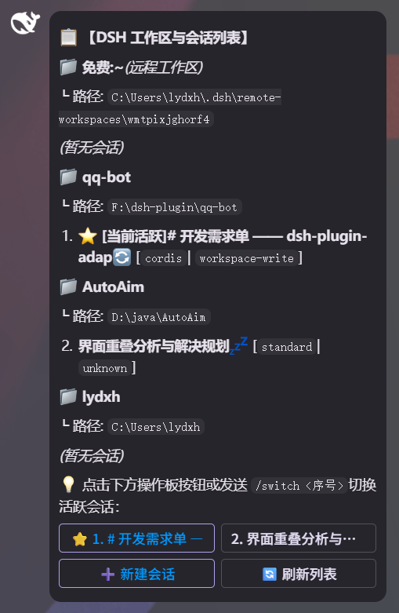
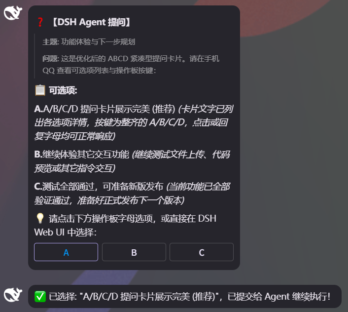
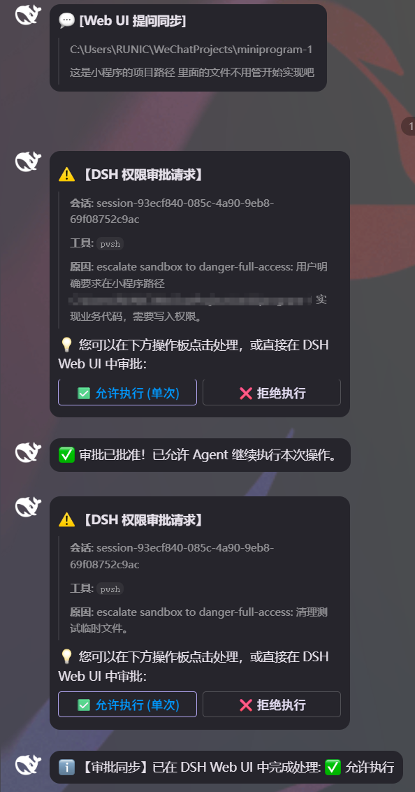
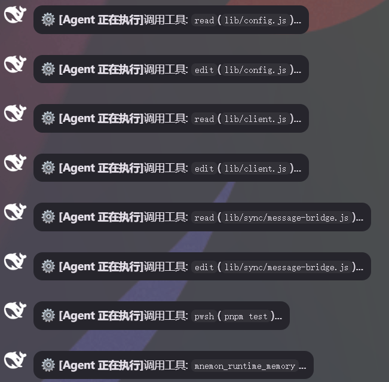
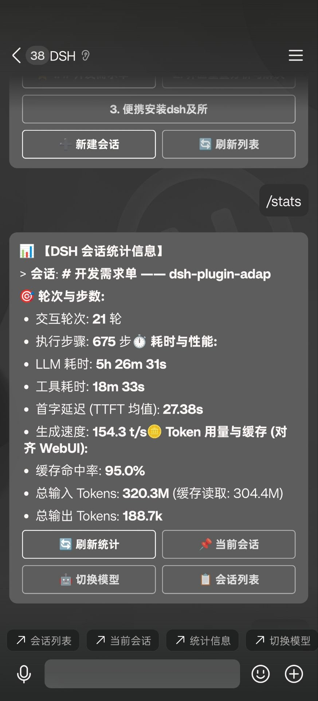
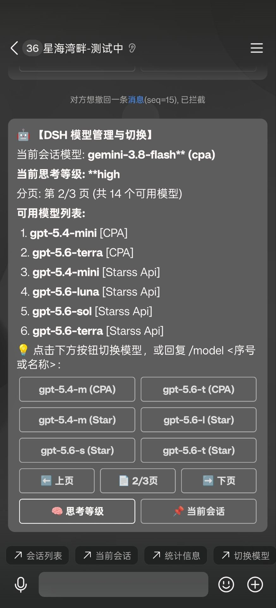
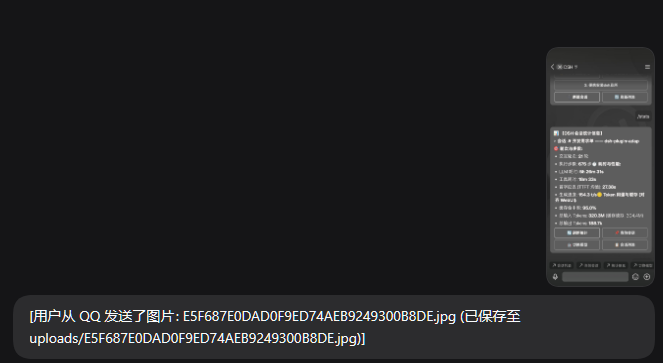
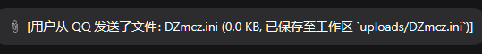

# dsh-adapter-qq

[](https://github.com/deepseek-ai/deepseek-harness)
[](https://bot.q.qq.com/wiki/develop/api-v2/)
[](LICENSE)

`dsh-adapter-qq` 是针对 [DeepSeek Harness (DSH)](https://github.com/deepseek-ai/deepseek-harness) 深度定制的 **QQ 官方机器人（C2C 单聊模式）适配器插件**。

通过本插件，你可以在手机或桌面 QQ 聊天窗口中直接与 DSH Agent 进行完整对话，享受 DSH 的全量编码与执行能力（文件读写、Shell 执行、代码运行、子代理、多步规划、工作流），并实现与 **DSH Web UI 实时双向同屏联动**。

---

## 🌟 核心特性

- 📱 **QQ 官方 OpenAPI v2**：基于 WebSocket Gateway 长连接（接收 `C2C_MESSAGE_CREATE` 与 `INTERACTION_CREATE`）+ OpenAPI HTTP 发送消息，无需第三方逆向协议，稳定合规。
- 🔄 **实时双向同屏同步**：
  - 在 QQ 中提问，Web UI 对应会话实时展现提问并同步生成结果。
  - 在 Web UI 中提问或执行操作，QQ 端实时推送同步进展与回复。
- 🚦 **双向审批联动（Approval Waterfall）**：
  - 遇到超权限操作（如文件修改、系统命令等）时，审批卡片**同时推送至 QQ 与 Web UI**。
  - 支持在 QQ 交互按钮上一键点击 `[允许 (本次)]` 或 `[拒绝]`，两端任一端处理立即同步结算。
- 🎮 **交互式操作板（InlineKeyboard）**：
  - 支持在聊天中生成交互式按钮面板，一键切换会话、选择预设、切换权限，无需繁琐输入。
- 📑 **全局自定义快捷菜单（PUT /v2/menu）**：
  - 启动后自动通过官方 [`PUT /v2/menu`](https://bot.q.qq.com/wiki/develop/api-v2/autogen/api/v2_menu.put.html) 接口向 QQ 开放平台注册底部快捷菜单，单聊底部直达会话列表、当前状态与快捷管理。
- 🧩 **动态预设与权限管理**：
  - 预设列表从 DSH 运行时**动态获取**（内置 `standard`, `ptc`, `minimal`, `cordis` + 用户自定义预设），绝不硬编码。
  - 支持在会话中即时切换权限级别：`只读` (`read-only`)、`工作区写入` (`workspace-write`)、`全系统` (`danger-full-access`)。
- ⚙️ **原生 Web UI 配置**：
  - 无需额外独立配置页，配置项通过 Cordis Settings 机制直接嵌入 DSH Web UI 原生设置页，安全保密字段（`clientSecret`, `token`）自动脱敏。

---

## 📸 运行效果展示 (Showcase)

| 1. 工作区与会话列表 (`/sessions`) | 2. Agent 交互提问 (`ask_user_question`) |
| :---: | :---: |
|  |  |
| **层级化对齐 DSH 侧边栏，支持按键一键切换** | **紧凑 A/B/C/D 操作板，点击即回传 Agent** |

| 3. 双向权限审批联动 (`/approve` / `/reject`) | 4. 实时工具调用执行进度 (可选聚合) |
| :---: | :---: |
|  |  |
| **QQ 与 Web UI 实时互斥结算，绝不悬挂** | **工具执行进度秒级感知，多操作自动聚合防刷屏** |

| 5. 会话统计数据 (`/stats` 对齐 WebUI) | 6. 模型选择与切换 (`/model` 操作板) |
| :---: | :---: |
|  |  |
| **轮次、步数、LLM耗时、TTFT及缓存命中率** | **列出可用模型，支持一键切换并设为默认** |

| 7. QQ 图片同步至 Web UI 聊天气泡 | 8. QQ 文件接收并保存至工作区 |
| :---: | :---: |
|  |  |
| **QQ 发送图片原生呈现在 Web UI 聊天流** | **QQ 发送文件自动保存至 uploads/ 并通知 Agent** |

---

## 📋 架构设计

```
QQ 开放平台 (q.qq.com)
  │
  ├─ WebSocket Gateway ───────▶ QQGatewayClient (lib/qq/gateway.js)
  │    (Hello, Heartbeat,          │  分发 C2C_MESSAGE_CREATE / INTERACTION_CREATE
  │     Identify, Resume)          ▼
  │                         MessageBridge (lib/sync/message-bridge.js)
  ├─ HTTP REST API ◀──────────  ├─ 指令解析器 (/sessions, /new, /switch, /preset, ...)
  │    (POST /v2/users/.../messages)  ├─ 交互操作板构建器 (lib/ui/keyboard.js)
  │    (PUT /v2/menu 快捷菜单)        ├─ 消息流式分段与清洗
  │                                   ▼
  │                         SessionManager (lib/sync/session-manager.js)
  │                             │  调用 ctx.sessionController / ctx.agentPresets / ctx.permissionPresets
  │                             ▼
  │                         DeepSeek Harness 核心运行时 (Cordis Framework)
  │                             ├─ ctx.sessions (会话上下文)
  │                             ├─ ctx.on('session/event') (双向消息监听)
  │                             └─ ctx.on('approval/request') (双向审批竞态)
  │                                   ▲
  └───────────────────────────── ApprovalHandler (lib/sync/approval-handler.js)
```

---

## 🚀 快速上手

### 1. 准备 QQ 开放平台机器人凭证

1. 前往 [QQ 开放平台官网](https://q.qq.com/) 注册并登录，创建机器人应用：
   - 个人开发者创建的**默认单聊机器人**即可直接使用，无需复杂配置。
2. 在 **开发设置** 中获取：
   - `AppID`（机器人应用 ID）
   - `AppSecret`（开发者密钥）
3. 机器人调试：若机器人尚未公开发布上线，建议开启**沙箱环境** (`sandbox: true`) 进行测试。

## 🚀 安装与部署

本插件是标准 DSH Bundle 插件包，声明了 `dsh.bundle.patch` 和 `dsh.client`，通过 DSH 官方 CLI 命令一行即可完成安装与自动挂载：

### 1. 安装插件

#### 从 npm 官方源安装（推荐）：
```bash
dsh plugin --profile web add dsh-adapter-qq
```

#### 或从 GitHub 仓库安装：
```bash
dsh plugin --profile web add github:jixishi/dsh-adapter-qq
```

> **卸载插件**：
> ```bash
> dsh plugin --profile web remove dsh-adapter-qq
> ```

---

### 2. 在 DSH Web UI 中配置

安装完成后，启动 DSH Web 界面（默认 `http://127.0.0.1:3080`），进入 **设置 (Settings)** 页面，展开 **【QQ 机器人 (QQ Bot)】** 卡片：

| 配置项 | 说明 | 默认值 |
| :--- | :--- | :--- |
| `enabled` | 是否启用 QQ Bot 适配器 | `true` |
| `appId` | 填写 QQ 开放平台的 Bot AppID | `""` |
| `clientSecret` | 填写 QQ 开放平台的 AppSecret（密文遮罩） | `""` |
| `sandbox` | 是否连接沙箱开发环境（测试期间推荐勾选） | `false` |
| `userOpenid` | 绑定的专属用户 OpenID（**留空将在收到首条消息时自动绑定**） | `""` |
| `defaultPreset` | 新建会话默认 Agent 预设 | `"standard"` |
| `defaultCwd` | 新建会话默认工作目录（留空使用当前 DSH 工作区） | `""` |
| `autoRegisterMenu` | 启动后自动向 QQ 开放平台注册底部自定义快捷菜单 | `true` |
| `markdown` | 消息回复优先使用 Markdown 渲染 | `true` |
| `syncToolCalls` | 是否同步推送工具调用执行进度（防刷屏，默认关闭） | `false` |
| `toolCallAggregateWindowMs` | 工具调用聚合推送窗口时间（毫秒，默认 30000ms / 30秒） | `30000` |

保存后，插件会立即热重载配置并自动建立 WebSocket 连接，无需重启 DSH。

---

## 💬 交互指令与操作说明

在 QQ 单聊窗口中，您可以直接发送以下指令或在底部菜单/操作板中点击按钮：

### 1. 会话管理与工作区导航

| 指令 | 简写/别名 | 功能说明 |
| :--- | :--- | :--- |
| `/sessions` | `/会话列表`, `/list` | 按工作区层级树形展示所有会话（本地与远程），带有人类可读标题与序号，附带操作板 |
| `/new` | `/新建会话`, `/create` | 启动交互式新建会话向导：选择已有工作区（本地/远程）或进入目录浏览器 |
| `/switch <序号或ID>` | `/切换 <序号或ID>` | 切换当前活跃会话（支持序号如 `/switch 1` 或会话标题/ID） |
| `/current` | `/当前会话`, `/info` | 查看当前活跃会话的详细信息与操作板 |

#### 新建会话交互向导流程：
1. **工作区选择 (第 1 步)**：发送 `/new`，操作板展示所有已有工作区（如 `📁 免费:~ (远程)`, `📁 qq-bot`, `📁 AutoAim`）及【🔍 浏览并选择目录】。
2. **目录选择与浏览 (第 2 步)**：支持按键深入子目录、`⬆️ 上级目录`、`➕ 新建目录`、`📄 上页/下页` 翻页。
3. **完成创建**：点击【✅ 选定当前目录创建】，即可完成会话创建并自动绑定为活跃会话！

### 2. 预设、模型与权限指令

| 指令 | 说明 |
| :--- | :--- |
| `/model` | 查看当前会话模型及所有可用模型列表，附带一键切换操作板 |
| `/model <名称或序号>` | 为当前会话切换 AI 模型（如 `/model gpt-5.6-luna` 或 `/model 2`） |
| `/stats` 或 `/统计` | 查看当前会话统计信息（轮次/步数、LLM耗时、首字延迟、解码速度、缓存命中率、Token用量，对齐 WebUI 底栏） |
| `/preset` | 显示当前预设及所有动态获取的可用预设列表（内置 + 自定义），附带切换按钮 |
| `/preset <名称>` | 为当前会话切换预设（如 `/preset ptc`，未产生交互前可换） |
| `/permission` | 显示当前权限级别及切换操作板 |
| `/permission <模式>` | 切换权限模式：`只读` (`read-only`)、`工作区` (`workspace-write`)、`全系统` (`danger-full-access`) |

### 3. 实时执行同步

在活跃会话中，Agent 的所有实时执行动作均会推送到 QQ：
- 🛠️ 工具调用过程提示：如 `⚙️ [Agent 正在执行] 调用工具: pwsh ...`。
- 💬 最终思考与回复：清洗内部控制标记后完整呈现，长文本自动智能分段，且被动回复过期时自动优雅降级为主动消息，避免漏发。

### 3. 执行控制与辅助指令

| 指令 | 说明 |
| :--- | :--- |
| `/cancel` 或 `/stop` | 中止当前 Agent 正在运行的轮次 |
| `/approve [ID]` | 批准待审批请求（支持操作板一键点击） |
| `/reject [ID]` | 拒绝待审批请求（支持操作板一键点击） |
| `/menu` | 手动强制向 QQ 开放平台同步底部快捷菜单 (`PUT /v2/menu`) |
| `/help` | 显示使用帮助菜单与全局快捷操作板 |

### 4. 自由对话

在设置活跃会话后，**发送任意非 `/` 开头的文本**，将直接转发给 DSH Agent：
- Agent 思考与执行过程在 QQ 与 Web UI 实时同步。
- 回复内容支持 Markdown 代码高亮、表格与长文本自动分段。
- Web UI 中的提问与操作亦会实时推送到 QQ 聊天中。

---

## 🧪 单元测试

本项目内置完整的单元测试套件（覆盖 API 客户端、InlineKeyboard 构建器、会话管理器、Gateway 网关协议、审批流中间件与消息桥接器）：

```bash
# 运行全部测试
pnpm test
```

测试结果：
```text
✔ QQApiClient (7 tests passed)
✔ KeyboardBuilder (9 tests passed)
✔ SessionManager (7 tests passed)
✔ QQGatewayClient (6 tests passed)
✔ ApprovalHandler (2 tests passed)
✔ MessageBridge (15 tests passed)
ℹ tests 46
ℹ suites 6
ℹ pass 46
ℹ fail 0
```

---

## ❓ 常见问题排查 (Troubleshooting)

1. **收到报错 `11255` 或发消息无响应？**
   - 检查 `sandbox` 配置是否与后台所处环境（测试沙箱 vs 正式）一致。
   - 检查 AppID 与 AppSecret 是否填写正确。
2. **提示 DNS 解析失败或连不上 `bots.qq.com`？**
   - 如果开启了代理软件（如 Clash、Shadowrocket TUN 模式等带有 fake-ip 功能），请确认 `bots.qq.com` 与 `*.qq.com` 直连，避免 fake-ip 解析异常拦截握手请求。
3. **切换预设提示 `session has already started; its agent preset is fixed`？**
   - DSH 原生架构约定：会话产生第一轮对话后，其 Agent 预设插件树即固化，不可热变更预设。如需使用其他预设，请使用 `/new [目录] <预设名>` 创建新会话。
4. **审批按钮点击无反应？**
   - 检查审批是否已在 Web UI 端先行处理；或者审批已超时关闭。两端任意一端处理后，状态会自动同步并提示已结算。

---

## 📄 开源许可证

本项目基于 [MIT License](LICENSE) 开源。
