# dsh-adapter-qq

[](https://www.npmjs.com/package/dsh-adapter-qq)
[](https://www.npmjs.com/package/dsh-adapter-qq)
[](LICENSE)
[](package.json)
[](package.json)
[](https://github.com/deepseek-ai/deepseek-harness)
[](https://bot.q.qq.com/wiki/develop/api-v2/)

`dsh-adapter-qq` 是针对 [DeepSeek Harness (DSH)](https://github.com/deepseek-ai/deepseek-harness) 深度定制的 **QQ 官方机器人（C2C 单聊模式）适配器插件**。

通过本插件，你可以在手机或桌面 QQ 聊天窗口中直接与 DSH Agent 进行完整对话，享受 DSH 的全量编码与执行能力（文件读写、Shell 执行、代码运行、子代理、多步规划、工作流），并实现与 **DSH Web UI 实时双向同屏联动**。

> **npm 当前版本：0.2.4**（`package.json`）。仓库 `main` 还包含 0.2.4 之后的一批未发布改动：定时任务完成通知、订阅管理双 Tab、设置页改版与「检查更新」、`/switch` 崩溃修复等，详见 [CHANGELOG.md](./CHANGELOG.md) 的「未发布」段。
>
> **兼容性**：`engines.dsh: >=0.2.1-rc.3 <0.3.0`，`engines.node: >=20`。
> 已适配 DSH 0.2.1 的 `SessionPromptRequest.mode`（`queue`/`steer`）、`ApprovalRequestEvent.agent`、`permissionPresets.catalog()`、`skills` 服务与 `sessionTitle`/`sessionQuery` 标题读取；旧版本 DSH 不再保证兼容。

## 📌 0.2.4 发布内容（回顾）

- **会话订阅（新）**：`/subscribe <会话> [分钟]` 订阅**非活跃**会话；后台新消息先累积，到间隔（1/5/15/30/60 分钟，默认 5）合并成**一条摘要**推送。连续消息不会推迟截止时间，空窗口不推送。
- **通知内快速回复**：摘要附「查看 / 快速回复 / 取消订阅 / 订阅列表」按钮；`/reply <会话> [内容]` 可直接定向发送；在 QQ 引用通知消息回复也会路由回该会话，**不切换当前活跃会话**。
- **订阅管理面板**：左侧导航栏「🔔 订阅管理」（与 Logcat / 插件 同列），可增删订阅、逐条调间隔、看待推送条数与**下次推送倒计时**、按**工作区分组**并显示**相对活跃时间**（刚刚 / N分钟 / N小时 / N天）。
- **超长自动转图片**：QQ 单条消息约 4000 字符上限，汇聚内容超限时用内嵌 Typst 渲染成图片发送（图片高度有上限，超出会截断并注明）；配置项 `subscriptionSendMode` 可选 `text`（默认）/ `auto` / `image`。
- **用量双数据源**：优先 `dsh-token-metrics`（含费用、TTFT、输出速度、项目/来源分布、供应商余额、日预算），回退 `@kenz1117/dsh-ui-usage-billing`。
- **卡片模板统一**：`/usage` `/stats` `/tasks` `/status` `/jobs` 全部走 Typst 卡片（其中 `/tasks` `/status` `/jobs` 此前只有纯 Markdown 排版）。
- **菜单整合**：技能管理 / MCP 服务 / 统计信息 / 用量计费 / 会话订阅 收进「管理」子菜单，顶层不再被查看类入口占满。
- **沙箱模式默认开启**：机器人正式上线前请保持开启，并在开放平台「测试人员管理」中加入您的 QQ 号。
- **修复**：订阅定时推送从不触发（`start()` → `stop()` 把调度器置空）、「立即推送」只推已到期会话、发送失败丢消息、失败重试风暴、渲染输出目录不可写导致图片退化为 Markdown 排版、面板高度写死、左栏图标风格不一致。
- **轮次异常结束播报**：一轮因报错/超限/被拦截/中断结束时，QQ 会收到状态提示（含停在哪一步工具、错误摘要）；用户自己 `/cancel` 的那次不会重复播报。设置项 `notifyTurnAbnormal` 默认开启。
- **宿主重启恢复**：轮次在重启/崩溃/HMR 时被中断的话，启动并连上 QQ 后可补发一条中断提示（默认**关闭**，设置项 `notifyRestartRecovery`；账本始终记录，打开即生效）。
- **插话方式可选**：`busyDelivery` 决定运行中发普通文本是「立即插话」还是「排队等本轮结束」，`/delivery` 可切换，`/steer`、`/queue` 单次覆盖，底部菜单也有「插话方式」入口。
- **会话卡显示最后一条用户消息**：`/sessions`、`/current` 与切换会话卡会带上「最后一条用户消息」或「最近一轮提问」。
- **审批不再被 Web UI 的「未接手」误判**：`unavailable` 不再当作「已拒绝」，QQ 卡片保持有效，也不再发假同步通知。
- **此前 0.2.3 能力**：`/stats` 统计卡片、菜单动态预设、`/usage` 范围与热力图、图片说明默认关闭、流式回复开关。

---

## 🌟 核心特性

- 📱 **QQ 官方 OpenAPI v2**：基于 WebSocket Gateway 长连接（接收 `C2C_MESSAGE_CREATE` 与 `INTERACTION_CREATE`）+ OpenAPI HTTP 发送消息，无需第三方逆向协议，稳定合规。
- 🔄 **实时双向同屏同步**：
  - 在 QQ 中提问，Web UI 对应会话实时展现提问并同步生成结果。
  - 在 Web UI 中提问或执行操作，QQ 端实时推送同步进展与回复。
- 🚦 **双向审批联动（Approval Waterfall）**：
  - 遇到超权限操作（如文件修改、系统命令等）时，审批卡片**同时推送至 QQ 与 Web UI**。
  - 支持在 QQ 交互按钮上一键点击 `[允许 (本次)]` 或 `[拒绝]`，两端任一端处理立即同步结算。
- ❓ **多问题 / 多选提问支持**：
  - `ask_user_question` 一次提交多个问题时按「第 1/3 题」向导逐题作答，全部答完后一次性提交完整答案批次（修复「连续多个提问只收到第一个」）。
  - 多选题显示 `✅` 选中状态，可反复点选、`🗑️ 清空`，或直接回复 `/answer <ID> A,B`，最后点 `✅ 提交选择`。
- 🎮 **交互式操作板（InlineKeyboard）**：
  - 支持在聊天中生成交互式按钮面板，一键切换会话、选择预设、切换权限，无需繁琐输入。
- 🗂️ **分页会话列表 + emoji 会话标识**：
  - 会话列表跨工作区展平分页（默认每页 6 个，可配置），每页内为每个会话分配**互不重复的 emoji**（🍎🍊🍋…）作为按键标识，列表里在会话名后附加同一 emoji。
  - 工作区路径可按配置显示**完整路径**或**仅最后一级文件夹**（`sessionPathDisplay`，默认 `tail`）。
  - 同一工作区下的会话合并为一个 **`>` 引用块**，形成「工作区 → 会话」的层级；会话名后的预设/权限使用可读名称（如 `标准模式` / `工作区写入`），不再直接显示 `standard` / `workspace-write` 这类 ID；自定义预设仍显示其 DSH 名称。
  - `/current` 的预设/权限同样使用可读名称。
  - 支持点击按键、`/switch <序号>`、`/switch <emoji>`、`/switch <标题关键字>` 三种切换方式。
- 🧭 **任务与代理状态图片（Typst 渲染）**：
  - `/status`（`/状态`、`/代理`）：一张图查看**主代理**状态（标题/模型/预设/权限/目录）、团队成员或子代理状态，以及正在进行的后台任务。
  - `/tasks`（`/任务`、`/任务管理`）：一张图查看 DSH「任务」页的定时/自动化任务（规则、状态、计划时间、绑定会话）。
  - `/jobs`（`/后台任务`）：仅在启用官方持久终端（`@deepseek-ai/dsh-terminal`）时自动注册，查看运行中的后台任务。
  - 官方团队插件（Agent Teams）启用时，`/status` 使用其 roster 渲染 Lead/成员角色与状态；未启用时回退到普通子代理列表。
  - 示例（主代理 + 团队成员 + 后台任务）：
    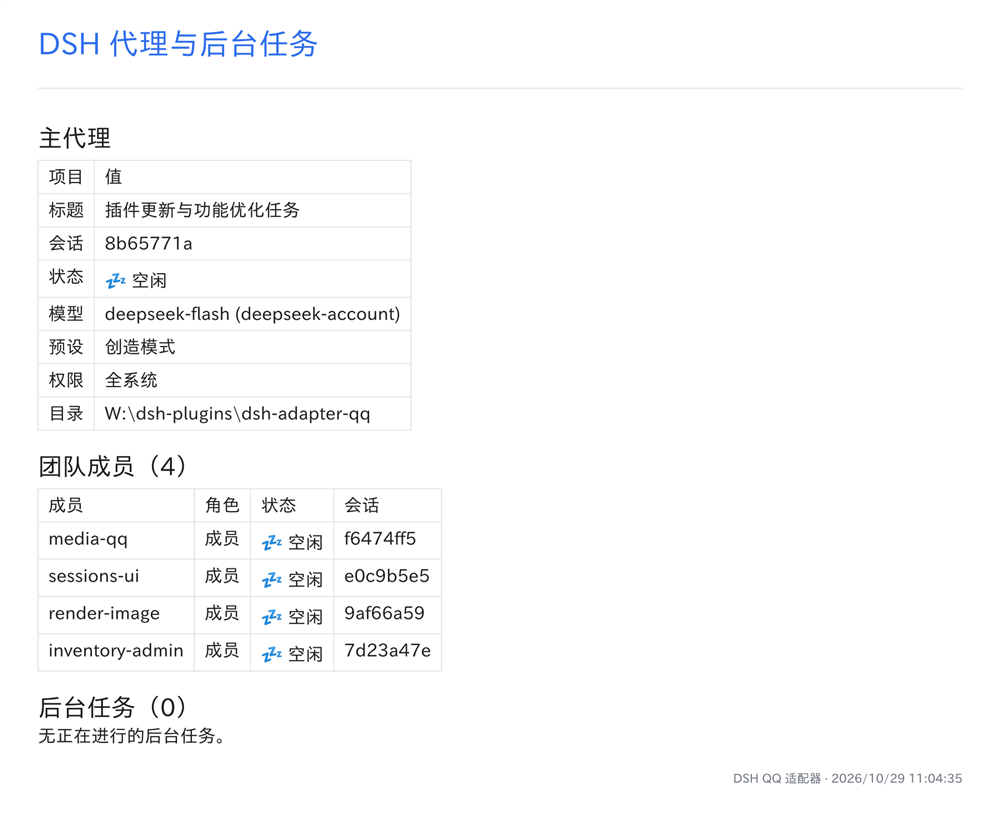
- 🔔 **会话订阅与定时汇聚通知**：
  - **订阅非活跃会话**：`/subscribe <会话> [分钟]` 或侧栏「订阅管理」面板。被订阅的会话在后台产生 `assistant/message` 或阻塞式提问时，不会立刻打扰你，而是先进入缓冲。
  - **定时汇聚**：汇聚窗口从**该会话的第一条**消息开始计时，窗口内到达的多条消息合并成**一条摘要**推送；窗口关闭后重新计时。连续不断的消息不会把推送无限推迟。
  - **间隔可按会话独立配置**：`1 / 5 / 15 / 30 / 60` 分钟（默认 5），手改存储里的非法值会吸附到最近档位，不会产生异常定时器。
  - **超长自动转图片**：QQ 单条消息约 4000 字符上限，汇聚内容超限时用内嵌 Typst 渲染成图片发送（图片高度也做了上限，超出会截断并注明）。配置项 `subscriptionSendMode` 可选 `text`（默认，超长才转图）/ `auto` / `image`（总是图片）。
  - **通知带操作按钮**：每条摘要附带「📖 查看 / 💬 快速回复 / 🛑 取消订阅 / 📋 订阅列表」。
  - **快速回复不切会话**：点「快速回复」或发 `/reply <会话> <内容>`，消息直接投递到目标会话；`/reply <会话>` 进入一次性定向态，**只对下一条消息生效**，当前活跃会话保持不变。
  - **引用即回复**：直接对订阅通知消息使用 QQ 的「回复」发送内容，会自动路由回该会话（按通知消息 ID 反查，最多保留最近 200 条）。
  - **左侧导航栏入口**：插件在**左侧导航栏**（与 Logcat / 插件 / 远程工作区 同一排）注册「🔔 订阅管理」入口。注册按 DSH 的配对规则：`sidebar.panellist`（`id` / `order` / `label` + 图标）与 `main`（`key` **必须等于**上面的 `id`）成对注册；只注册一侧会导致插件能加载、点入口却没内容。面板用**两个 Tab** 区分功能：「会话订阅」负责增删订阅、待推送条数、逐条调整汇聚间隔与「立即推送」；「定时任务」列出官方定时任务并逐任务开关通知。
  - **持久化**：订阅写在 `$DSH_HOME/adapter-qq/subscriptions.json`（临时文件 + rename 原子替换）；文件损坏时降级为空订阅而不是让插件启动失败。
- ⏰ **定时任务完成通知**：官方 `@deepseek-ai/dsh-schedule` 触发的任务执行完后，QQ 会收到「⏰ 任务名 · 已完成」+ 结果摘要；超过 800 字符的长结果自动渲染成图片。逐任务开关在订阅管理的「定时任务」Tab，默认开启；开关持久化到 `$DSH_HOME/adapter-qq/schedule-notices.json`。会话忙时提醒会排队，等它自己的轮次结束才播报，不会拿别的轮次的结果顶替。任务本身的增删改仍在 DSH「任务」页面，插件不做。
- 🔄 **插件更新检查**：设置页「插件更新」区显示当前版本与 npm 最新版本（宿主路由 `/dsh-adapter-qq/update-check`，带 10 分钟缓存），只对比版本号，不会自动下载或安装。
- 💰 **用量计费联动（可选，两个数据源任选其一）**：
  - **优先 `dsh-token-metrics`**（[hugoyee75-cmyk/dsh-token-metrics](https://github.com/hugoyee75-cmyk/dsh-token-metrics)）：读取本机 `/api/dsh-token-metrics/summary`，除费用/调用/Token/缓存与 30 天热力图外，额外渲染**平均首字延迟（TTFT）**、**输出速度（t/s）**、**项目分布**、**来源分布（主会话/子代理/workflow）**、**供应商余额与订阅配额**、**日预算进度**，以及「未匹配到价格」的模型清单；金额按快照里的 `cost.fx.usdCny` 从美元换算。
  - **回退 `@kenz1117/dsh-ui-usage-billing`**：读取 `/api/billing/usage-stats`、`/pricing` 与 `/relay-quotas`，模型名取计费目录显示名，站点名取中转登记名称，未知域名脱敏。
  - 两者的命令与渲染完全一致（`/usage [日|月|年|累计]`，别名 `/用量`、`/费用`、`/账单`）；**同时安装时 `dsh-token-metrics` 优先**。统计口径：缓存命中率 = 命中 /（命中 + 新读入），`cacheWrite` 不计入分母；`累计` 取插件自身的全量 totals（避免按天分桶被保留期裁剪后偏小）。
  - 未安装任何用量插件时，发送 `/usage` 会同时给出两种插件的安装命令；底部菜单与 `/help` 仅在检测到其中之一时加入「用量费用」入口与说明。
  - 图片发送后的文字说明默认关闭（`sendOverviewCaption`），需要时在设置中开启。
  - 示例：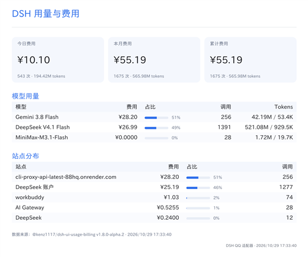
- 🖼️ **富媒体收发（图片 / 文件）**：
  - 入站：QQ 转发的图片按**字节魔数**识别真实格式（png/jpeg/gif/webp），修复 `Declared image type does not match its bytes.`；文件自动保存到会话 `uploads/` 并把文本预览/路径交给 Agent。
  - 出站：`/send <路径>`、Agent 回复中的图片/文件、以及 `qq_send_file` 工具均可通过官方富媒体接口（`/v2/users/{openid}/files` + `msg_type=7`）发回 QQ，支持 ≤5MB 直传与 >5MB 分片上传。
- 🧠 **技能管理菜单（/skills）**：
  - 聚合 DSH 技能列表（名称、来源、可调用性、停用状态），支持查看详情与**启停**（启停通过 `@xxxyz/dsh-mcp-manager` 的能力；该插件未安装时自动降级为只读列表）。
- 🔌 **MCP 管理菜单（/mcp）**：
  - 列出 MCP 服务（传输方式、层级、加载状态、工具数），支持查看工具清单、**启停与重启**；未安装 MCP 管理器时按工具注册表降级展示。
- 🖨️ **文本一键渲染为图片（内嵌 Typst）**：
  - `/render [文本]` 把文本/Markdown 渲染为图片发回 QQ（无参数时渲染最近一条 Agent 回复）。
  - 注册 Agent 工具 **`qq_render_text_image`** 与 **`qq_send_file`**，模型可主动调用。
  - 渲染引擎优先级：**内嵌 Typst 0.15（LXGW Neo XiHei + Noto Color Emoji，全彩 Emoji/CJK 原生混排）** → 本机 Edge/Chrome 无头单次截图 → Pillow → 纯 SVG。
  - Typst 与两个字体随插件依赖内嵌（`@flukxr/typst-cli`、`@fontpkg/lxgw-neo-xi-hei`、`noto-color-emoji`），无需系统安装；单次排版+光栅化约 30ms 引擎耗时。
- 🔗 **官方扫码绑定（扫码配置）**：
  - 设置页提供「生成绑定二维码」，走 `q.qq.com` 官方 bind-task 协议：`/lite/create_bind_task` → 手机 QQ 扫描 `connect.html?task_id=…` → `/lite/poll_bind_result` 轮询。
  - 扫码确认后自动填入 **AppID / AppSecret / 绑定用户 OpenID** 并保存；`bot_encrypt_secret` 用本地生成的 AES-256-GCM 密钥加密回传，仅本机解密，密钥不出进程。
  - 所有失败都返回结构化错误（`code` / `message` / `retcode` / `detail`）并显示在设置页，便于定位 q.qq.com 拒绝原因或网络问题。
- 📑 **全局自定义快捷菜单（PUT /v2/menu）**：
  - 启动后自动通过官方 [`PUT /v2/menu`](https://bot.q.qq.com/wiki/develop/api-v2/autogen/api/v2_menu.put.html) 注册底部快捷菜单，按当前环境动态生成：会话列表 / 当前会话 / 模型与思考 / 权限模式 / 插话方式 / 管理（技能、MCP、统计、用量、订阅）/ 任务与状态 / 快捷操作；未安装的能力（用量计费、官方定时任务、持久终端等）对应入口自动省略。
- 🧩 **动态预设与权限管理**：
  - 预设列表从宿主 `agentPresets.list()` **动态获取**（内置 + 用户自定义预设），绝不硬编码。宿主只给 `id` 时回落到可读名称（标准模式 / PTC 模式 / 极简模式 / 创造模式）；自定义预设显示其声明的名称。
  - 权限列表优先读取 `permissionPresets.catalog()`，支持在会话中即时切换 `只读` (`read-only`)、`工作区写入` (`workspace-write`)、`全系统` (`danger-full-access`)。
- ⚙️ **原生 Web UI 配置**：
  - 无需额外独立配置页：配置通过导出的 `Config` schema（全部 `volatile`）投影，客户端在 **设置 → 插件 → QQ 机器人** 注册独立 tab，按 7 个分区组织；保密字段（`clientSecret`、`token`、`mcpManagerToken`）自动脱敏。设置页顶部提供「检查更新」，仓库/发布页链接带图标。

---

## 📸 运行效果展示 (Showcase)

| 1. 工作区与会话列表 (`/sessions`) | 2. Agent 交互提问 (`ask_user_question`) |
| :---: | :---: |
| 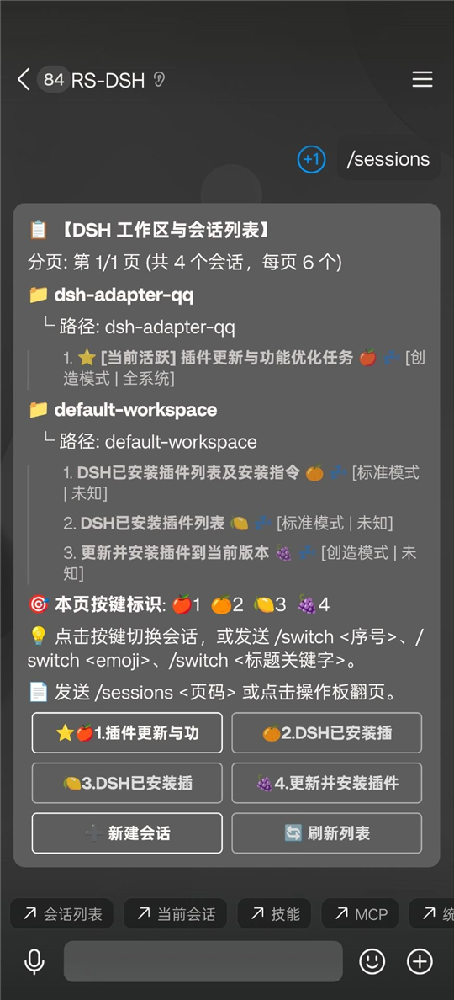 | 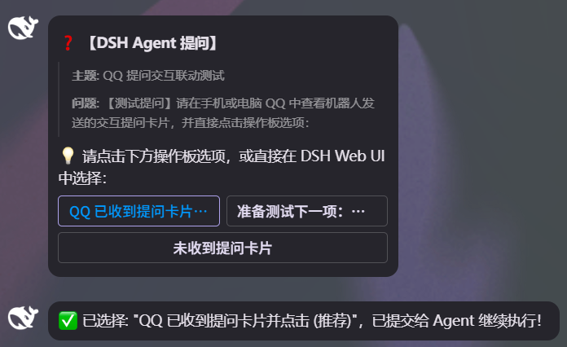 |
| **层级化对齐 DSH 侧边栏，支持按键一键切换** | **紧凑 A/B/C/D 操作板，点击即回传 Agent** |

| 3. 双向权限审批联动 (`/approve` / `/reject`) | 4. 实时工具调用执行进度 (可选聚合) |
| :---: | :---: |
| 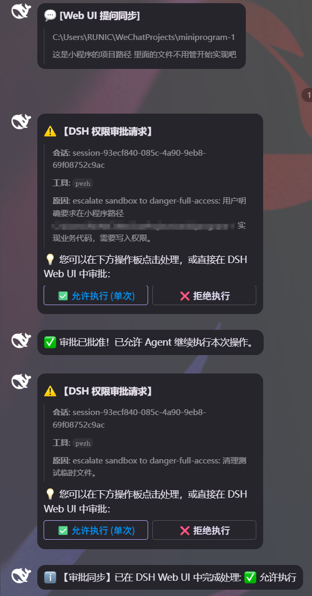 | 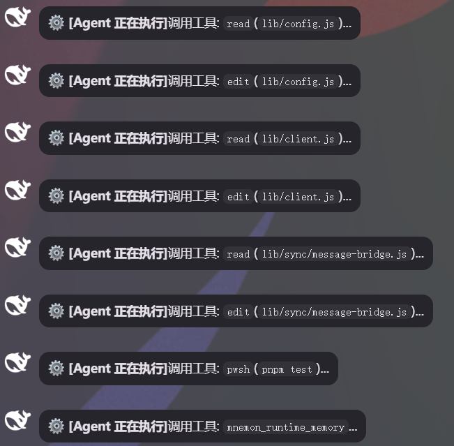 |
| **QQ 与 Web UI 实时互斥结算，绝不悬挂** | **工具执行进度秒级感知，多操作自动聚合防刷屏** |

| 5. 会话统计数据 (`/stats` 统计卡片) | 6. 模型选择与翻页 (`/model` 操作板) |
| :---: | :---: |
| 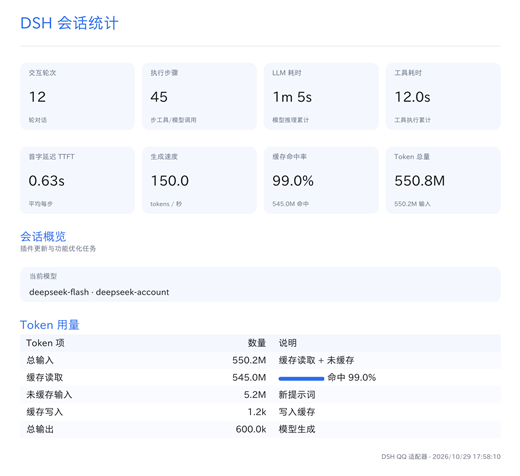 | 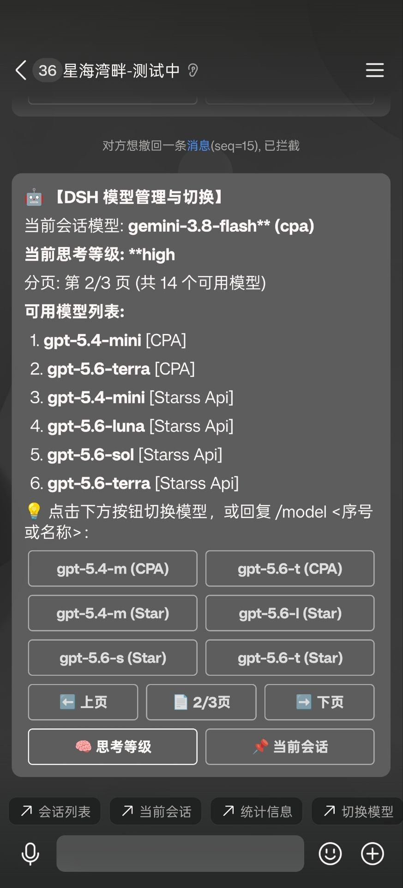 |
| **轮次、步数、LLM耗时、TTFT及缓存命中率** | **支持多供应商模型识别与上一页/下一页翻页** |

| 7. 思考等级管理 (`/effort` 操作板) | 8. QQ 图片同步至 Web UI 聊天气泡 |
| :---: | :---: |
| 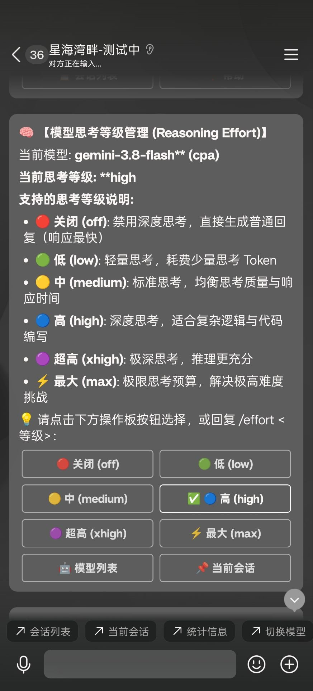 | 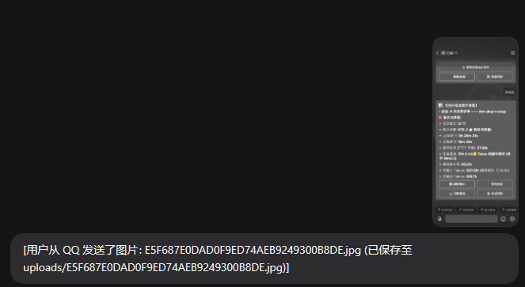 |
| **支持 off/low/medium/high/xhigh/max 实时切换** | **QQ 发送图片原生呈现在 Web UI 聊天流** |

| 9. QQ 文件接收并保存至工作区 |
| :---: |
| 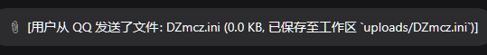 |
| **QQ 发送文件自动保存至 uploads/ 并通知 Agent** |

---

## 📋 架构设计

```
QQ 开放平台 (q.qq.com)
  │
  ├─ WebSocket Gateway ───────▶ QQGatewayClient (lib/qq/gateway.js)
  │    (Hello, Heartbeat,          │  分发 C2C_MESSAGE_CREATE / INTERACTION_CREATE
  │     Identify, Resume)          ▼
  │                         MessageBridge (lib/sync/message-bridge.js)
  ├─ HTTP REST API ◀──────────  ├─ 指令解析器 (/sessions, /switch, /skills, /mcp, /render, /send ...)
  │    (POST /v2/users/.../messages)  ├─ 交互操作板构建器 (lib/ui/keyboard.js + lib/ui/emoji.js)
  │    (POST /v2/users/.../files)     ├─ 消息流式分段与清洗
  │    (PUT /v2/menu 快捷菜单)        ├─ 富媒体出站（图片/文件转发、渲染图回传）
  │                                   ▼
  │                         SessionManager (lib/sync/session-manager.js)
  │                             │  会话分页 / emoji 分配 / 标题与权限读取
  │                             ▼
  │                         DeepSeek Harness 核心运行时 (Cordis Framework)
  │                             ├─ ctx.sessions / ctx.sessionController (会话与 prompt)
  │                             ├─ ctx.on('session/event') (双向消息监听)
  │                             ├─ ctx.on('approval/request') (双向审批竞态)
  │                             ├─ ctx.skills / ctx.permissionPresets
  │                             └─ ctx.tools (qq_render_text_image / qq_send_file)
  │                                   ▲
  ├───────────────────────────── ApprovalHandler (lib/sync/approval-handler.js)
  ├───────────────────────────── AdminInventory (lib/sync/inventory.js)
  │                                └─ POST /dsh-mcp-manager/api（技能/MCP 启停；缺失则只读降级）
  └───────────────────────────── Render pipeline (lib/render/*)
                                   └─ Typst（内嵌）→ Edge/Chrome headless → Pillow → SVG 兜底
```

---

## 🚀 快速上手

一共三步：**装插件 → 填凭证 → 私聊机器人**。

### 1. 准备 QQ 开放平台机器人凭证

1. 前往 [QQ 开放平台](https://q.qq.com/) 注册并登录，创建机器人应用；个人开发者的默认单聊机器人即可。
2. 在**开发设置**中获取 `AppID` 与 `AppSecret`。
3. 在「测试人员管理」中加入你自己的 QQ 号。插件的 `sandbox` **默认开启**，正式上线前请保持开启。

> 也可以跳过手工抄凭证，直接用下面的**扫码绑定**自动填入。

### 2. 安装插件

本插件是标准 DSH Bundle 插件（`dsh.bundle.patch` + `dsh.client`），用 DSH CLI 装到**你实际使用的 profile**：

```bash
# <profile> 换成你的 profile 名；桌面版默认通常是 desktop
dsh plugin --profile <profile> add dsh-adapter-qq
```

`--profile` 是必填项（不写会报 `required option '--profile <name>' not specified`）。可用 `dsh plugin --help` 查看；profile 不存在时 CLI 会提示如何用同一条命令创建它。

```bash
# 升级 / 卸载
dsh plugin --profile <profile> update
dsh plugin --profile <profile> remove dsh-adapter-qq
```

从源码开发时可用 `link:` 挂载本地目录（改动后触发一次 profile 重组即可生效，无需重启整个应用）：

```powershell
dsh plugin --profile <profile> add link:<本目录绝对路径>
```

### 3. 在 DSH Web UI 中配置

打开 DSH Web 界面（地址由 `dsh web` 启动时打印，**不是固定端口**），进入 **设置 → 插件 → 「QQ 机器人」** tab。

**推荐：扫码绑定** —— 点击「生成绑定二维码」，用手机 QQ 扫码确认；成功后自动填入 AppID、AppSecret 与绑定 OpenID。二维码约 2 分钟有效，失败时界面会显示 `[code] message`、`retcode`、`detail`。也可以直接手工填表。

> 所有配置字段均声明为 `volatile`，保存后写入 profile patch 并即时热应用：修改 AppID/AppSecret/沙箱会自动重连，**不需要重启 DSH**。设置页还带「检查更新」（只对比 npm 版本号，不下载不安装）。

| 配置项 | 说明 | 默认值 |
| :--- | :--- | :--- |
| `enabled` | 是否启用 QQ Bot 适配器 | `true` |
| `appId` | 填写 QQ 开放平台的 Bot AppID | `""` |
| `clientSecret` | 填写 QQ 开放平台的 AppSecret（密文遮罩） | `""` |
| `sandbox` | 是否连接沙箱开发环境（**默认开启**；机器人正式上线前请保持开启，并需在开放平台「测试人员管理」中加入您的 QQ 号） | `true` |
| `userOpenid` | 绑定的专属用户 OpenID（**留空将在收到首条消息时自动绑定**） | `""` |
| `defaultPreset` | 新建会话默认 Agent 预设 | `"standard"` |
| `defaultCwd` | 新建会话默认工作目录（留空使用当前 DSH 工作区） | `""` |
| `autoRegisterMenu` | 启动后自动向 QQ 开放平台注册底部自定义快捷菜单 | `true` |
| `markdown` | 消息回复优先使用 Markdown 渲染 | `true` |
| `syncWebQuestions` | 把 Web UI 端输入的提问同步推送到 QQ（默认关闭，避免频繁打扰） | `false` |
| `syncToolCalls` | 是否同步推送工具调用执行进度（防刷屏，默认关闭） | `false` |
| `toolCallAggregateWindowMs` | 工具调用聚合推送窗口时间（毫秒，默认 30000ms / 30秒） | `30000` |
| `sessionPageSize` | 会话列表每页数量（QQ 操作板建议 ≤6） | `6` |
| `sessionPathDisplay` | 会话列表工作区路径显示：`tail` 仅最后一级文件夹 / `full` 完整路径 | `tail` |
| `autoSendAttachments` | Agent 回复中的图片/文件自动转发到 QQ | `true` |
| `sendOverviewCaption` | 渲染图片发送后是否再补发文字说明 | `false` |
| `streamReply` | 是否启用流式回复（按增量持续推送回复文本） | `false` |
| `streamIntervalMs` | 流式推送间隔（毫秒，500–10000） | `1500` |
| `renderWidth` | 文本渲染图片的像素宽度（480–1600） | `900` |
| `renderTheme` | 文本渲染图片主题（`light` / `dark`） | `light` |
| `subscriptionSendMode` | 订阅汇聚通知发送形式：`text`（默认，超长自动转图片）/ `auto` / `image`（总是图片） | `text` |
| `busyDelivery` | Agent 运行中时普通文本如何投递：`steer` 立即插话 / `queue` 本轮结束后发送 | `steer` |
| `notifyTurnAbnormal` | 轮次非正常结束时向 QQ 推送状态提示 | `true` |
| `notifyRestartRecovery` | 宿主重启后补发在途轮次的中断提示 | `false` |
| `mcpManagerToken` | `@xxxyz/dsh-mcp-manager` 写操作令牌（可选，密文遮罩；也可用环境变量 `DSH_MCP_MANAGER_TOKEN`） | `""` |

> 表中是**用户可见**的设置项。`token`、`activeSessionId`、`allowFrom` 等内部字段不占用设置页行，由插件自身维护。

保存后，插件会立即热重载配置并自动建立 WebSocket 连接，无需重启 DSH。随后在 QQ 里给机器人发一条私聊消息，即完成 OpenID 绑定。

---

## 💬 交互指令与操作说明

在 QQ 单聊窗口中，您可以直接发送以下指令或在底部菜单/操作板中点击按钮：

### 1. 会话管理与工作区导航

| 指令 | 简写/别名 | 功能说明 |
| :--- | :--- | :--- |
| `/sessions [页码]` | `/会话列表`, `/list` | 分页展示所有会话（跨工作区展平），**每页内每个会话带互不重复的 emoji 标识**，操作板可点击切换/翻页 |
| `/new` | `/新建会话`, `/create` | 启动交互式新建会话向导：选择已有工作区（本地/远程）或进入目录浏览器 |
| `/switch <序号\|emoji\|ID>` | `/切换 <…>` | 切换当前活跃会话（支持全局序号如 `/switch 3`、当前页 emoji 如 `/switch 🍊`、会话 ID 前缀或标题关键字） |
| `/current` | `/当前会话`, `/info` | 查看当前活跃会话的详细信息与操作板 |
| `/status` | `/状态`, `/代理` | 图片查看主代理、团队成员（启用 Agent Teams 时）/子代理状态，以及正在进行的后台任务 |
| `/tasks` | `/任务`, `/任务管理`, `/schedule` | 图片查看 DSH「任务」页的定时/自动化任务（规则、状态、计划时间、绑定会话） |
| `/jobs` | `/后台任务` | 图片查看运行中的后台任务；仅在启用官方持久终端时自动注册 |
| `/usage [日\|月\|年\|累计]` | `/用量`, `/费用`, `/账单` | 图片查看指定范围的费用/调用/Token/缓存指标、模型/站点分布与 30 天热力图；安装 `dsh-token-metrics` 或 `@kenz1117/dsh-ui-usage-billing` 时自动注册（前者的 TTFT/输出速度/项目/来源/供应商余额/日预算也会一并渲染） |
| `/subscribe [会话] [分钟]` | `/订阅` | 订阅**非活跃**会话：后台新消息先累积，到间隔后合并成一条摘要推送。间隔支持 **1 / 5 / 15 / 30 / 60 分钟**（默认 5）；不带参数时订阅当前活跃会话 |
| `/subscriptions` | `/订阅列表` | 列出全部订阅：会话标题、汇聚间隔、待推送条数、是否活跃；附「取消 / 打开」按键 |
| `/unsubscribe [会话]` | `/取消订阅` | 取消订阅；不带参数时取消当前活跃会话（或唯一的那个订阅） |
| `/reply <会话> [内容]` | `/回复`, `/快速回复` | **定向快速回复**：只给会话时进入一次性定向态（下一条消息直达该会话）；带内容时立即发送。**不切换**当前活跃会话；`/reply off` 取消。也可直接**引用订阅通知消息**回复 |

#### 新建会话交互向导流程：
1. **工作区选择 (第 1 步)**：发送 `/new`，操作板展示所有已有工作区（如 `📁 免费:~ (远程)`, `📁 qq-bot`, `📁 AutoAim`）及【🔍 浏览并选择目录】。
2. **目录选择与浏览 (第 2 步)**：支持按键深入子目录、`⬆️ 上级目录`、`➕ 新建目录`、`📄 上页/下页` 翻页。
3. **完成创建**：点击【✅ 选定当前目录创建】，即可完成会话创建并自动绑定为活跃会话！

### 2. 预设、模型与权限指令

| 指令 | 说明 |
| :--- | :--- |
| `/model` | 查看当前会话模型及所有可用模型列表，附带一键切换操作板 |
| `/model <名称或序号> [供应商]` | 为当前会话切换 AI 模型（如 `/model gpt-5.6-luna` 或 `/model 2`） |
| `/effort [等级]` 或 `/思考` | 查看或切换思考等级（`off`, `low`, `medium`, `high`, `xhigh`, `max`），附带操作板 |
| `/stats` 或 `/统计` | 以 **Typst 统计卡片** 图片展示当前会话统计（轮次/步数、LLM/工具耗时、首字延迟、生成速度、缓存命中率、Token 明细），对齐 WebUI 底栏 |
| `/preset` | 显示当前预设及所有动态获取的可用预设列表（内置 + 自定义），附带切换按钮 |
| `/preset <名称>` | 为当前会话切换预设（如 `/preset ptc`，未产生交互前可换） |
| `/permission` | 显示当前权限级别及切换操作板 |
| `/permission <模式>` | 切换权限模式：`只读` (`read-only`)、`工作区` (`workspace-write`)、`全系统` (`danger-full-access`) |

### 3. 技能 / MCP / 渲染与文件发送

| 指令 | 说明 |
| :--- | :--- |
| `/skills [页码]` 或 `/技能` | 技能管理：分页列出技能（名称/来源/可调用性/启停状态），点击进入详情，支持 `✅/⛔` 状态展示 |
| `/skill <名称>` | 查看单个技能详情（来源、provider、路径、适用场景、模型/用户可调用性） |
| `/skill on\|off <名称>` | 启用 / 停用技能（需安装 `@xxxyz/dsh-mcp-manager`，否则只读并提示） |
| `/mcp [页码]` 或 `/服务` | MCP 服务管理：分页列出服务（传输、层级、加载状态、工具数） |
| `/mcp <ID或名称>` | 查看单个 MCP 服务详情与工具清单 |
| `/mcp on\|off <ID>` | 启用 / 停用 MCP 服务 |
| `/mcp restart <ID>` | 重启 MCP 服务 |
| `/render [文本]` 或 `/渲染` | 把文本/Markdown 渲染成图片并发回 QQ；不带参数时渲染当前会话最近一条 Agent 回复 |
| `/send <路径>` 或 `/发送文件` | 把本地文件发送到 QQ（相对路径按当前会话工作目录解析） |

**Agent 可调用工具（由插件注册到 DSH）：**

| 工具 | 说明 |
| :--- | :--- |
| `qq_render_text_image` | 把 Markdown/纯文本渲染成图片（`text` 必填；`title`/`theme`/`width`/`send`/`filename` 可选），默认同时发送到当前绑定的 QQ 会话，返回本地文件路径与尺寸 |
| `qq_send_file` | 把本地文件或 base64 内容发送到 QQ（`path` 或 `data_base64`，`as_image`/`filename`/`msg_id` 可选） |

> 渲染引擎优先级：内嵌 Typst（霞鹜新晰黑 + Google 全彩 Emoji）→ 本机 Edge/Chrome 无头截图 → Pillow（需 Python + Pillow）→ 纯 SVG 兜底。可用环境变量 `QQ_ADAPTER_BROWSER` 指定浏览器路径、`QQ_ADAPTER_PYTHON` 指定 Python 解释器。

### 4. 实时执行同步

在活跃会话中，Agent 的所有实时执行动作均会推送到 QQ：
- 🛠️ 工具调用过程提示：如 `⚙️ [Agent 正在执行] 调用工具: pwsh ...`。
- 💬 最终思考与回复：清洗内部控制标记后完整呈现，长文本自动智能分段，且被动回复过期时自动优雅降级为主动消息，避免漏发。
- 🖼️ 回复中携带的图片/文件会自动转成 QQ 富媒体消息（`autoSendAttachments` 可关闭）。

### 5. 执行控制与辅助指令

| 指令 | 说明 |
| :--- | :--- |
| `/cancel` 或 `/stop` | 中止当前 Agent 正在运行的轮次 |
| `/approve [ID]` | 批准待审批请求（支持操作板一键点击） |
| `/reject [ID]` | 拒绝待审批请求（支持操作板一键点击） |
| `/answer <ID> <选项>` | 回答 Agent 的提问；多选题可回复 `A,B` 或点击操作板逐个选择后提交 |
| `/menu` | 手动强制向 QQ 开放平台同步底部快捷菜单 (`PUT /v2/menu`) |
| `/help` | 显示使用帮助菜单与全局快捷操作板 |

### 6. 自由对话

在设置活跃会话后，**发送任意非 `/` 开头的文本**，将直接转发给 DSH Agent：
- Agent 思考与执行过程在 QQ 与 Web UI 实时同步。
- 回复内容支持 Markdown 代码高亮、表格与长文本自动分段。
- Web UI 中的提问与操作亦会实时推送到 QQ 聊天中。

---

## 🧪 单元测试

本项目内置单元测试套件，覆盖 API 客户端、富媒体上传、操作板与 emoji、会话分页、Gateway 协议、审批与多问题提问、消息桥接、订阅与定时任务通知、设置页契约、渲染引擎与 agent 工具：

```bash
node test/all.js
# 或：pnpm test
```

本机实测（Windows / Node 26，无头浏览器受限时对应 1 例跳过）：

```text
ℹ tests 599
ℹ pass 598
ℹ fail 0
ℹ skipped 1
```

> 测试里读取源码一律用 `fileURLToPath(import.meta.url)` 推导仓库根目录，不写绝对路径，保证 Linux CI 也能跑。

---

## ❓ 常见问题排查 (Troubleshooting)

1. **收到报错 `11255` 或发消息无响应？**
   - 检查 `sandbox` 配置是否与后台所处环境（测试沙箱 vs 正式）一致。
   - 检查 AppID 与 AppSecret 是否填写正确。
2. **提示 DNS 解析失败或连不上 `bots.qq.com`？**
   - 如果开启了代理软件（如 Clash、Shadowrocket TUN 模式等带有 fake-ip 功能），请确认 `bots.qq.com` 与 `*.qq.com` 直连，避免 fake-ip 解析异常拦截握手请求。
3. **切换预设提示 `session has already started; its agent preset is fixed`？**
   - DSH 原生架构约定：会话产生第一轮对话后，其 Agent 预设插件树即固化，不可热变更预设。如需使用其他预设，请使用 `/new [目录] <预设名>` 创建新会话。
4. **审批按钮点击无反应？**
   - 检查审批是否已在 Web UI 端先行处理；或者审批已超时关闭。两端任意一端处理后，状态会自动同步并提示已结算。
5. **QQ 发图报 `Declared image type does not match its bytes.`？**
   - 0.2.0 已修复：插件改为按字节魔数判定真实图片格式（png/jpeg/gif/webp），不再信任 QQ 的 `content_type`。若仍出现，请确认插件版本 ≥ 0.2.0 且 DSH 为 0.2.1-rc.3。
6. **`/skills` 或 `/mcp` 提示只读 / 未安装管理器？**
   - 启停能力依赖 `@xxxyz/dsh-mcp-manager`（其 HTTP API 必须可访问）。未安装或未启用时，菜单自动降级为只读列表；安装后发送 `/skills` 或 `/mcp` 刷新即可。
7. **`/render` 很慢或提示回退引擎？**
   - 默认使用**内嵌 Typst**（无需系统安装任何东西），中文与全彩 Emoji 由随包字体渲染，通常几十毫秒完成；若 Typst 不可用才回退本机 Edge/Chrome 无头截图 → Pillow → SVG。可用 `QQ_ADAPTER_BROWSER` 指定浏览器路径（设为 `off` 跳过浏览器），`QQ_ADAPTER_PYTHON` 指定 Python。
   - 若 Typst 报错，插件日志会打印最后三行 Typst 诊断（`[adapter-qq] Typst 渲染失败 ...`）。
8. **发送大文件失败？**
   - QQ 单聊文件软限制 200MB，>5MB 会自动走分片上传（prepare → 分片 PUT → part_finish → merge）；若网络中断请重试。图片 >20MB 会被 QQ 降级为文件类型上传。

---

## 📄 开源许可证

本项目基于 [MIT License](LICENSE) 开源。
